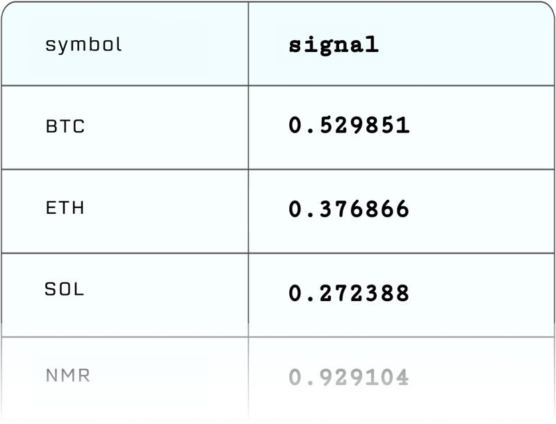

# 提出

Crypto Signalsの作成に使用される基礎データは非常に異なる場合があります（監査済みの財務データ、ニュース記事、駐車場の画像など）が、Crypto Signals自体はすべて基本的なフォーマットで提供されます。これは、トークンシンボルのリストとそれぞれに関連付けられた数値の組み合わせです。



あなたの提出で使用するトークンシンボルのリストは、**Numerai Cryptoのトークンユニバース**によって定義されています。このリストは、世界で最も大きなトークン上位300位程度をカバーしており、毎日更新されます。一般的に、1日に移動するのは少数の低ボリュームのトークンですが、これは市場のボラティリティに依存し、暗号通貨は非常に不安定であることは誰もが知っている通りです。

最新のユニバースは、`live.parquet`ファイルをダウンロードすることで確認できます。

トークンユニバースは、時価総額で上位300のトークンで定義されており、以下のものを除きます：

 - ステーブルコイン、ラップトークン、リキッドステーキングトークン（例：stETH, rpETH）
 - 2年未満のトークン
 - 過去24時間で100万ドル未満の取引量のトークン
 - 重複するシンボルのうち時価総額が低いトークン

上記が除外された後、以下の条件でさらにトークンが除外されます：

- 安定しすぎている：6ヶ月間の平均日次リターンが0.00001未満のトークン
- 高い相関：過去6ヶ月間のデイリーリターンの相関が0.95以上のトークンを除外し、最も時価総額が高いものを残します。

シグナルを提出する際には、少なくとも2つのカラムを含める必要があります：

- `symbol` カラム - 値はライブユニバース内の有効なシンボルでなければなりません。
- `signal` カラム - 値は0と1の間かつ排他的でなければなりません。

さらに、ライブ提出が有効であるためには：

- ユニバースから少なくとも100のシンボルが有効な値（0から1）を持っていなければなりません。
- シンボルは1回だけ表示される必要があります。

APIを使用して提出のワークフローを自動化することができます。提出APIは、ParquetとCSVファイル形式の両方をサポートしています。以下は、NumerAPIを使用して提出をアップロードする例です：

```python
from numerapi import NumerAPI

# 認証
napi = NumerAPI("[your api public id]", "[your api secret key]")
napi.upload_predictions("[path to your submission]", tournament=12)
```

次のいずれかを使用することができます：

 - [Numerapi](https://github.com/uuazed/numerapi)（公式Pythonクライアント）
 - 他の言語向けの[Raw GraphQL API](https://api-tournament.numer.ai/)
 - オープンソースのクラウド自動化ツールである[Numerai Compute](https://github.com/numerai/numerai-cli)
