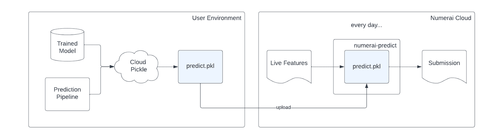
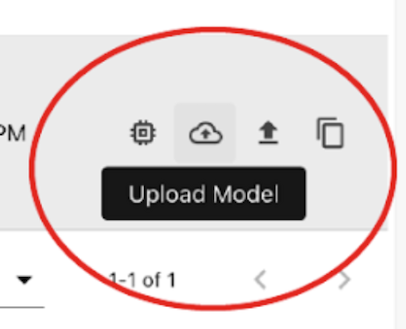
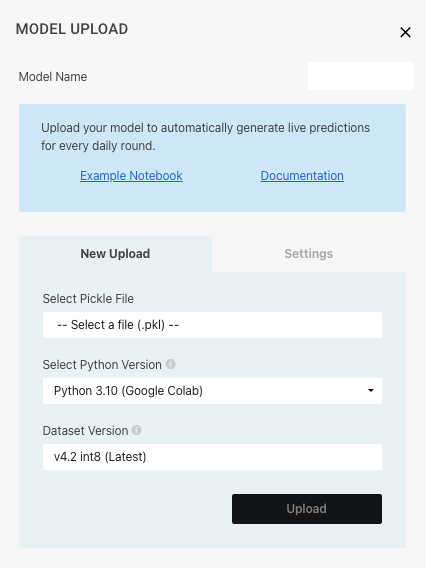
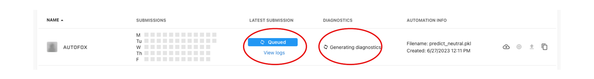
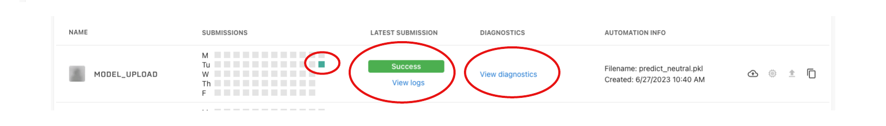
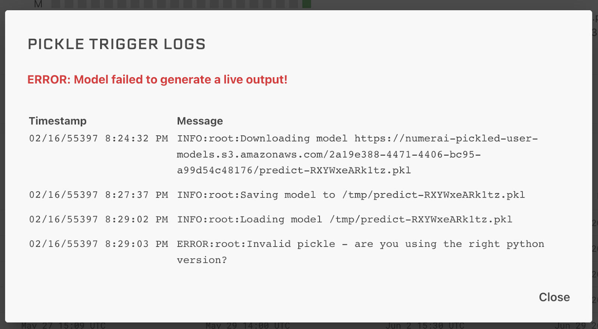

# model uploads

## はじめに
モデルアップロードは、毎日の投稿を自動化するシンプルで無料の方法です。

## 仕組み 
 1. Liveデータを受け取り、ライブの予測を出力する関数でモデルをラップします。
 2. [Cloudpickleライブラリ](https://github.com/cloudpipe/cloudpickle)で関数をpickle化し、pickleされたファイルをNumeraiにアップロードします。
 3. Numeraiがあなたのモデルを毎日実行し、[実行環境](https://github.com/numerai/numerai-predict)でLiveデータの予測を行います。



## モデルをPickle化する方法

以下に簡単な例を示します。以下のように、liveのデータをpandasで受け取り、pandasのdataframeでデータを返すような関数をcloudpickleでpickle化することで完了します。

```python
# Wrap your model with a function that takes live features and returns live predictions
def predict(live_features: pd.DataFrame) -> pd.DataFrame:
    live_predictions = model.predict(live_features[feature_cols])
    submission = pd.Series(live_predictions, index=live_features.index)
    return submission.to_frame("prediction")

import cloudpickle
p = cloudpickle.dumps(predict)
with open("predict.pkl", "wb") as f:
    f.write(p)
```

[Numerai公式が公開しているチュートリアル](https://colab.research.google.com/github/numerai/example-scripts/blob/master/hello_numerai.ipynb)なども参照してください。

## pickleファイルのアップロード方法

[提出ページ](https://numer.ai/submissions)の右側にあるUpload Modelボタンを見つけてください。



モデルのアップロードボタンをクリックし、アップロードモーダルを開きます。アップロードしたいpickleファイルを選択し、pickleの作成に使用したPythonのバージョンを設定し、Uploadをクリックします。



アップロードが完了すると、Numeraiは直ちにあなたのモデルを実行し、現在のラウンドのライブサブミッションを生成し、検証データセットに対して診断を生成します。



これらが完了すると、投稿欄に投稿ブロックが表示され、最新の投稿欄に成功ステータスが表示され、診断欄に診断結果を表示するリンクが表示されます。



## 投稿状況の確認方法

上記のアップロードが完了すると、以下の4つのステータスで最新の投稿サイクルを見ることができます：

 - Pending: Numeraiは、あなたのモデルを実行するためにクラウドリソースをプロビジョニングしています。

 - Running: Numeraiはあなたのモデルを実行中です。

 - Validating: Numeraiはあなたのモデルを実行し、現在あなたの提出を検証しています。

 - Success: Numeraiはあなたの投稿を受理しました。

問題があった場合、2つのステータスが表示されます：

Error: Numerai はあなたのモデルを実行する際に予期せぬエラーに遭遇しました。

Failed: モデルの実行に失敗しました。ログを確認し、動作するモデルを再アップロードしてください。

モデル失敗の例としては、以下が考えられます。

 - Pythonまたは依存関係のバージョンの不一致
 - 投稿が無効（フォーマットエラーなど）
 - メモリ不足
 - タイムアウト



エラーが出る場合、以下の「Numerai predictを理解する」も参考にしてください。

## Cloudpickleを理解する

Cloudpickleは、ローカルのPythonコードをクラウド上で簡単にリモート実行できるライブラリです。.NETや.NETのような人気のある分散コンピューティングフレームワークの裏で使われています。

cloudpickleを使う主な利点は、コードと一緒にローカルコンテキストをシリアライズしてくれることです。そのため、Google Colabのようなノートブック環境でローカルに開発したコードをパッケージ化するのにとても便利です。

下の例では、関数はグローバルスコープで定義されたmodelとfeature_colsを参照しています。Cloudpickleは賢いので、modelとfeature_colsの両方を値によって正しくシリアライズし、この関数がNumeraiによって実行されるときにも利用できるようにします。

```python
def predict(features: pd.DataFrame) -> pd.DataFrame：
    # modelとfeature_colsはグローバルスコープで定義されます。
    live_predictions = model.predict(features[feature_cols])
    submission = pd.Series(live_predictions, index=features.index)
    return submission.to_frame("prediction")
```

## Numerai Predictを理解する

[Numerai Predict](https://github.com/numerai/numerai-predict) はモデルの実行環境です。

cloudpickleはローカル環境のPython自身やPythonライブラリをシリアライズしないので、あなたのコードがNumerai PredictでサポートされているPythonのバージョンやライブラリと互換性があることを確認する必要があります。

問題をデバッグする際には、numerai-predict dockerコンテナをダウンロードしてローカルでテストすることが役に立つかもしれません。

ローカルで以下のコマンドを叩くことでエラーの詳細を知ることができます（参考：[Numerai Predict](https://github.com/numerai/numerai-predict)）。

```bash
docker run -i --rm -v "$PWD:$PWD" ghcr.io/numerai/numerai_predict_py_3_10:stable --model $PWD/model.pkl
```

私たちは、すべての業界標準のPython機械学習ライブラリをサポートすることを目指しています。あなたのパイプラインが現在サポートされていないライブラリを使用している場合は、お知らせください。

## リソースの制約と制限

セキュリティ上の理由から、アップロードされたモデルはインターネットにアクセスできません。

また、各モデルに1CPU、4GBのRAMを搭載したマシンを用意し、最大10分のランタイムを許可します（キューに入る時間は含みません）。

参考までに、いくつかの例のランタイムを示します。

 - small特長量（32個）、2万個（20k）の木を使ったLGBMモデルは、small特長量を使って1分未満
 
 - 全特長量（>1000特長量）、9万個（90k）の木を使ったLGBMモデルの実行時間は6分未満 

## 投稿アップロードと計算との相互作用

model uploadを行うと、Numerai compute経由での送信が無効化されます。

## この機能のデメリットについて

この機能は、インフラの設定や管理に時間を費やしたくない、新規〜中級ユーザー向けに設計されています。

この機能のデメリットとしては、学習済みモデルをアップロードする（そしてNumeraiにアクセス権を与える）必要があることです。

この点に抵抗がある場合は、[Numerai CLI](https://jp.docs.numer.ai/numerai-tnamento/numerai-compute)などを検討してください。

## 利用規約

Numeraiは、セキュリティ上の懸念やアカウントがアクティブでなくなった場合など、いかなる理由でもあなたのモデルを無効にする権利を留保します。

Numeraiは、この機能の使用をサポートするために最善を尽くしますが、最終的には、あなたの投稿パイプラインが適切に設定されていることを確認するのはあなたの責任です。
